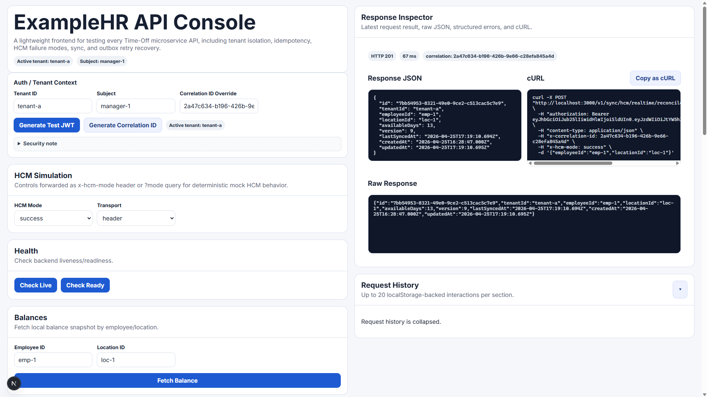

# ExampleHR Time-Off Service

NestJS + Prisma backend with a Next.js frontend console for testing time-off flows, HCM sync behavior, and outbox retries.

## Repository

- GitHub: [https://github.com/ShaheerLuqman/Wizdaa-ExampleHR](https://github.com/ShaheerLuqman/Wizdaa-ExampleHR)



## Deliverables Checklist

- [x] **TRD provided**: [`TRD.md`](./TRD.md)
- [x] **Code in GitHub repository**: [ShaheerLuqman/Wizdaa-ExampleHR](https://github.com/ShaheerLuqman/Wizdaa-ExampleHR)
- [x] **Test cases and proof of coverage provided**:
  - Test command: `npm test`
  - Coverage command: `npm run test:cov`
  - Coverage report artifact: `coverage/lcov-report/index.html`
  - Latest coverage summary (end of document): [Test Cases and Proof of Coverage](#test-cases-and-proof-of-coverage)

## Stack

- Backend: NestJS, Prisma, SQLite
- Frontend: Next.js (App Router)
- Runtime: Node.js

## Prerequisites

- Node.js 18+ (22 recommended)
- npm

## Setup

```bash
cp .env.example .env
npm install
npm install --prefix frontend
npm run prisma:generate
npm run prisma:migrate
```

## Run

### Start everything (recommended)

```bash
npm run start:all
```

This starts:

- Backend: `http://localhost:3000`
- Frontend: `http://localhost:3001`
- Mock HCM: `http://localhost:4001`

The start script also attempts to stop stale local stack processes before launching fresh ones.

### Start services individually

Backend:

```bash
npm run start:dev
```

Frontend:

```bash
npm run frontend:dev
```

Mock HCM:

```bash
npm run mock:hcm
```

## Environment

Copy or edit `.env` as needed. Common values:

- `PORT=3000`
- `FRONTEND_ORIGIN=http://localhost:3001`
- `HCM_BASE_URL=http://localhost:4001`
- `DATABASE_URL=file:./dev.db`

## Useful Scripts

- `npm run build` - build backend
- `npm run test` - run tests
- `npm run test:cov` - run tests with coverage
- `npm run prisma:generate` - generate Prisma client
- `npm run prisma:migrate` - run local migrations

## Notes

- The frontend includes an API console for triggering all backend endpoints.
- Request logs are emitted by backend middleware to help verify requests hit BE.
- If you see `EADDRINUSE`, stop stale local processes or rerun `npm run start:all`.

## How to Use the Frontend Console

1. Start all services:
   ```bash
   npm run start:all
   ```
2. Open the frontend at `http://localhost:3001`.
3. In **Auth / Tenant Context**:
   - set `tenantId` (for example `tenant-a`)
   - click **Generate Test JWT**
4. Seed balance data first using **Batch Sync** (required for request creation/approval flows).
5. Run core flow:
   - **Create Request** -> expect `PENDING`
   - **Approve Request** -> expect `APPROVED` (in success mode)
   - verify updated value in **Balances**
6. Test resilience flow:
   - set HCM mode to `transient_error`
   - approve request -> expect `FAILED_SYNC`
   - switch mode back to `success`
   - run **Outbox Process** -> expect recovery to `APPROVED`

For full FE behavior and scenario design details, refer to [`fe.md`](./fe.md).

## Test Cases and Proof of Coverage

Run coverage:

```bash
npm run test:cov
```

Latest coverage run summary:

- Test suites: `9 passed, 9 total`
- Tests: `26 passed, 26 total`
- Statement coverage: `91.38%`
- Line coverage: `90.78%`

Coverage artifacts are generated under:

- `coverage/`
- `coverage/lcov-report/index.html` (HTML report)
