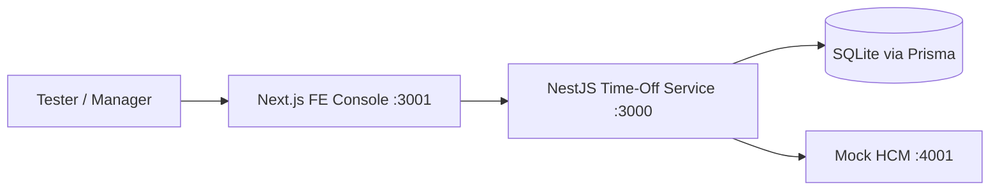
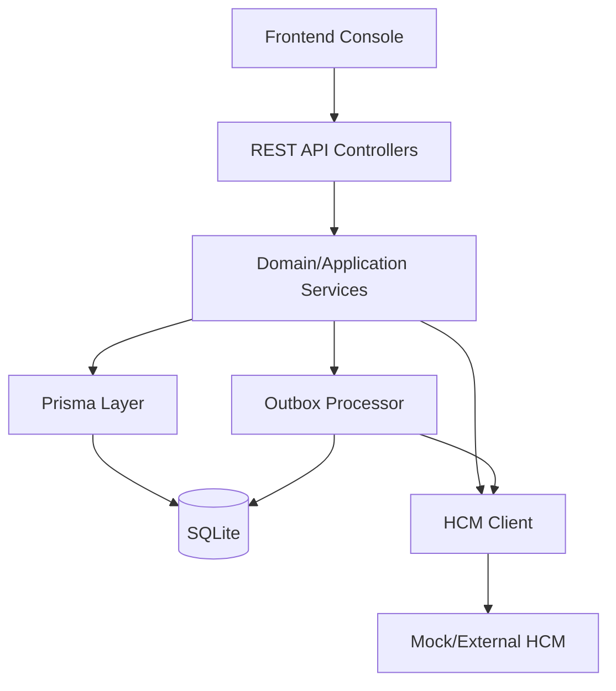
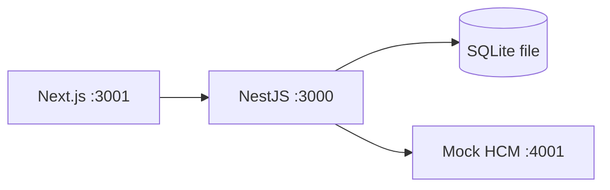

# Technical Requirements Document (TRD)

This document is the engineering specification for the ExampleHR Time-Off system implementation.

---

## 1. Document Overview

### Purpose

Define the technical requirements, architecture, and implementation approach for a Time-Off system where:

- ExampleHR is the user-facing request system
- HCM is the source of truth for balances

### Scope

In scope:

- Backend microservice (NestJS + Prisma + SQLite)
- Frontend API test console (Next.js)
- Mock HCM integration for deterministic testing
- Request lifecycle, sync, retry, idempotency, and reconciliation
- Testing and coverage evidence

Out of scope:

- Production identity provider integration
- Full enterprise infra (Kubernetes, autoscaling stack)
- Rich end-user HR product UI beyond API console

### Definitions and Acronyms

- **TRD**: Technical Requirements Document
- **HCM**: Human Capital Management system (source of truth)
- **NFR**: Non-Functional Requirement
- **OCC**: Optimistic Concurrency Control
- **API**: Application Programming Interface
- **JWT**: JSON Web Token

### References

- Product prompt PDF: `ExampleHR_-_take_home_exercise.pdf`
- Build decisions: `claude.md`
- Frontend implementation spec: `fe.md`
- Repository: [Wizdaa-ExampleHR](https://github.com/ShaheerLuqman/Wizdaa-ExampleHR)

---

## 2. System Overview

### System Description

Employees create time-off requests in ExampleHR. Requests require manager approval. HCM validates/debits balances on approval. System handles transient failures with outbox retries and supports batch/realtime reconciliation.

### Key Components and Modules

- **Frontend**: API test console (Next.js App Router)
- **Backend** (NestJS modules):
  - `time-off-requests`
  - `balances`
  - `hcm-integration`
  - `sync`
  - `health`
  - `prisma`
- **Database**: SQLite
- **Mock HCM**: deterministic HTTP server (`scripts/mock-hcm.ts`)

### High-Level Architecture Diagram



### Major Dependencies

- NestJS runtime and middleware
- Prisma ORM and generated client
- SQLite file database
- Mock HCM external dependency simulation

---

## 3. Requirements Breakdown

### Functional Requirements

1. Create time-off request as `PENDING`.
2. Require manager approval for debit execution.
3. Debit HCM only on approval.
4. Handle HCM transient and terminal failures distinctly.
5. Persist retries via outbox for transient failures.
6. Support batch sync and realtime reconcile with HCM.
7. Enforce idempotent create behavior.
8. Enforce tenant isolation for all entities and endpoints.
9. Provide health and operational endpoints.

### User/System Flows

- Employee create -> `PENDING`
- Manager approve -> sync debit with HCM -> `APPROVED`
- Manager reject -> `REJECTED`
- Approve with transient failure -> `FAILED_SYNC` -> outbox retry -> `APPROVED`
- HCM batch -> overwrite local balances, audit discrepancies
- Reconcile -> refresh single balance from HCM

### Input/Output Expectations

- JSON request/response contracts
- Standardized error envelope with correlation ID
- URL versioning under `/v1/...`

### Non-Functional Requirements (NFRs)

- **Performance**: sub-200ms target for non-HCM-blocked internal operations
- **Scalability**: modular service boundaries; future-compatible with horizontal scale
- **Reliability/Availability**: retry + outbox for transient dependency failures
- **Security**: JWT-based tenant scoping, strict access isolation
- **Maintainability**: modular NestJS architecture + tests
- **Compliance constraints**: immutable request/audit records retained indefinitely (as per design decision)

---

## 4. System Architecture

### Detailed Architecture Diagram



### Component Responsibilities

- Controllers: transport, validation, auth guard integration
- Services: state transitions, HCM orchestration, retry decisions
- Prisma layer: persistence and transactional atomicity
- Sync/outbox: eventual consistency workflows
- FE: scenario-driven API exercising and request diagnostics

### Communication Patterns

- **REST + JSON** for FE->BE and BE->HCM
- **Sync flows** for user-triggered operations
- **Async flow** via outbox retries for transient failures

### Sync vs Async Flows

- Sync: create request, approve/reject, balance fetch, reconcile
- Async: outbox retry worker processing for `FAILED_SYNC` requests

### Data Flow Summary

1. Create request -> DB (`PENDING`)
2. Approve -> HCM debit call
3. Success: update request + balance
4. Transient failure: mark `FAILED_SYNC`, enqueue outbox
5. Outbox process: retry debit, finalize state

---

## 5. API Design

### Endpoints

- `GET /v1/health/live`
- `GET /v1/health/ready`
- `GET /v1/balances/:employeeId/:locationId`
- `POST /v1/time-off-requests`
- `GET /v1/time-off-requests/:requestId`
- `POST /v1/time-off-requests/:requestId/approve`
- `POST /v1/time-off-requests/:requestId/reject`
- `POST /v1/sync/hcm/batch`
- `POST /v1/sync/hcm/realtime/reconcile`
- `POST /v1/sync/outbox/process`

### Request/Response

- Content type: `application/json`
- URL versioning: `/v1/...`

### Authentication

- Bearer JWT expected
- `tenantId` and `sub` claims required

### Error Handling Standard

```json
{
  "error": {
    "code": "INSUFFICIENT_BALANCE",
    "message": "Not enough leave balance",
    "correlationId": "..."
  }
}
```

### Rate Limiting

- Not implemented in this take-home scope.
- Planned for production hardening.

---

## 6. Data Design

### Database Choice

- SQLite (exercise scope), accessed via Prisma

### Main Schema Entities

- `EmployeeBalance`
- `TimeOffRequest`
- `IdempotencyKey`
- `OutboxEvent`
- `SyncAuditLog`

### Indexing and Constraints

- Unique `(tenantId, employeeId, locationId)` on balances
- Global unique `idempotencyKey`
- Additional indexes for status/lookups in sync and requests

### Data Lifecycle

- Request and audit records treated as immutable event trail
- Retention: indefinite (per agreed decision)

### Entity Relationships

- `TimeOffRequest` <- optional relation -> `OutboxEvent`
- `EmployeeBalance` keyed by tenant/employee/location

---

## 7. Component-Level Design

### Service Responsibilities

- `TimeOffRequestsService`: create, approve, reject, state transitions
- `BalancesService` + writer: read and OCC updates
- `SyncService`: batch and reconcile operations
- `OutboxService`: retry orchestration with backoff
- `HcmClient`: external request/response mapping

### Internal Logic Highlights

- Explicit transition guards:
  - `PENDING -> APPROVED | REJECTED | FAILED_SYNC`
  - `FAILED_SYNC -> APPROVED`
- Retry classification:
  - transient => retryable
  - terminal => no retry

### Design Patterns Used

- Layered architecture (controller/service/persistence)
- Outbox pattern for retry reliability
- Idempotency key replay pattern
- OCC using version field

---

## 8. External Integrations

### HCM API Integration

- Realtime debit endpoint
- Realtime balance endpoint
- Batch balance synchronization endpoint

### Webhooks/Events

- Not webhook-based in current scope
- Batch sync is push-in endpoint into backend

### Failure Handling

- Transient errors -> outbox retry
- Terminal errors -> no retry, explicit failure state

---

## 9. Security Design

### Authentication and Authorization

- JWT bearer token parsing in guard
- `tenantId`-based isolation enforced in queries

### Encryption

- In transit: expected via HTTPS in production environments
- At rest: SQLite file encryption not implemented in take-home scope

### Secrets Management

- Environment variables (`.env`) for local setup
- Production secret manager is future work

### Threat Considerations (OWASP-oriented)

- Input validation via DTO + validation pipe
- Tenant boundary checks to prevent data leakage
- Defensive error responses with correlation IDs

### Access Control Model

- Tenant-scoped access model (multi-tenant isolation)
- Role nuance (employee vs manager) simplified for exercise

---

## 10. Scalability and Performance Strategy

### Scaling Approach

- Current: single instance suitable for take-home
- Future: horizontal scaling enabled by stateless API layer

### Caching Strategy

- No cache layer currently (e.g., Redis) in scope
- Potential future: short-lived balance cache with explicit invalidation

### Load Balancing

- Not required for local deployment
- Production-ready path: LB in front of stateless API instances

### Database Scaling

- Current: SQLite local file
- Future: migrate to managed SQL with replication/read scaling

### Bottleneck Analysis

- Primary bottleneck likely external HCM latency/availability
- Mitigated via outbox retries and deterministic failover behavior

---

## 11. Error Handling and Logging

### Logging Strategy

- FE logs request/response in browser console
- BE logs request hits and completion timing in server console
- HCM mock logs inbound mode and outbound status

### Monitoring/Alerting

- Not fully instrumented in take-home scope
- Hook points available through structured logs

### Retry Mechanisms

- Exponential backoff on transient HCM failures
- Max attempts: 5
- Exhausted events remain for manual intervention

### Graceful Failure

- Standardized error envelope
- Deterministic transition to `FAILED_SYNC` when needed

### Traceability

- Correlation IDs propagated and returned in error responses

---

## 12. Deployment and Infrastructure

### Deployment Model

- Local development and evaluation scripts
- Multi-process startup script launches FE, BE, mock HCM

### CI/CD

- Not fully defined in repository scope
- Test/build scripts provided for pipeline integration

### Environment Setup

- Dev: `.env` + local services
- Staging/prod: planned extensions

### Infrastructure Diagram (Current)



### Rollback Strategy

- Code rollback via git deploy process
- DB schema rollback strategy not fully modeled for production in this scope

---

## 13. Testing Strategy

### Unit Testing

- Domain policy tests
- Guard/filter/middleware/interceptor tests
- Service-level focused branch tests

### Integration and E2E

- End-to-end request lifecycle
- Retry/outbox flows
- Tenant isolation and sync paths

### Load/Performance Testing

- Not implemented in take-home scope

### Coverage Expectations

- Achieved:
  - Statements: `91.38%`
  - Lines: `90.78%`
- Command: `npm run test:cov`
- Artifacts:
  - `coverage/`
  - `coverage/lcov-report/index.html`

---

## 14. Assumptions and Constraints

### Assumptions

- HCM remains canonical for balances
- JWT includes required tenant claims
- Manager approval is mandatory for debit

### Constraints

- SQLite-based local persistence
- No production auth provider in this scope
- No production infra orchestration in this scope

### External Dependencies Outside Control

- HCM availability and response behavior

### Risks and Mitigation

- HCM instability -> outbox retry with capped attempts
- Concurrency races -> OCC + conflict handling
- Duplicate requests -> idempotency replay

---

## 15. Open Questions / Future Work

- Add rate limiting and abuse controls
- Add production-grade authentication integration
- Add observability stack (metrics/traces/alerts)
- Add role-based policy depth (manager/employee permissions)
- Migrate persistence to production-grade managed SQL
- Add performance/load test suites

---

## 16. Appendix

### A. Repository and Artifacts

- Repo: [Wizdaa-ExampleHR](https://github.com/ShaheerLuqman/Wizdaa-ExampleHR)
- Supporting docs:
  - `claude.md`
  - `fe.md`
  - `README.md`

### B. HCM Simulation Modes

- `x-hcm-mode: success | insufficient | invalid | transient_error`
- Query override: `?mode=...`

### C. Quick Runbook

```bash
npm run start:all
```

Services:

- Backend: `http://localhost:3000`
- Frontend: `http://localhost:3001`
- Mock HCM: `http://localhost:4001`

